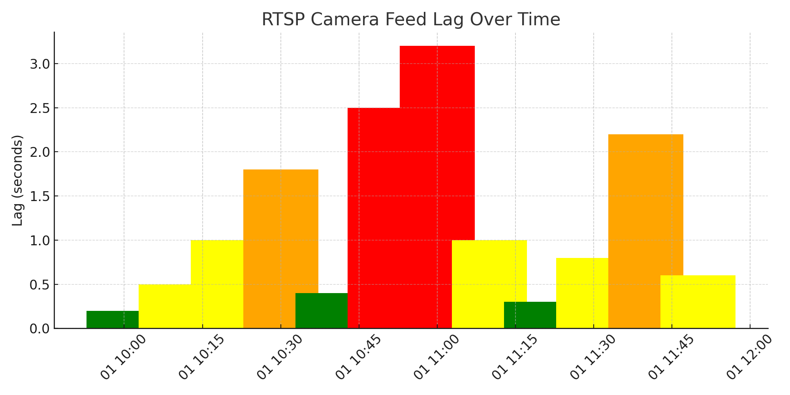

# RTSP Camera Lag Detection & Analytics Dashboard

A Python-based tool to monitor live RTSP camera feeds, detect lag spikes in real-time, and visualize lag analytics using a structured dashboard.

## 🚀 Project Summary

This system was developed as part of my internship at Tata Steel to monitor live camera feeds in high-risk coal feed zones of the A-F Blast Furnace. It detects lag levels (green-yellow-orange-red), logs events, and enables historical lag trend analysis.

## 🎯 Features

- 🟢 Real-time monitoring of dual RTSP feeds  
- 🔴 Lag detection with color-coded severity (Green → Red)  
- 🗃️ Logs stored with timestamps and lag severity  
- 📊 Dashboard to visualize lag patterns over time  
- 🖥️ GUI using Tkinter for viewing feeds and alerts  

## 🧠 Technologies Used

- Python (OpenCV, Multithreading, Tkinter)
- Structured Logging
- Basic Root-Cause Analytics

## 📁 File Structure

| File / Folder     | Description                                      |
|-------------------|--------------------------------------------------|
| `main.py`         | Main entry point for the system                  |
| `lag_logger.py`   | Module to calculate lag and log to file          |
| `gui.py`          | Tkinter GUI to display feeds and lag indicators  |
| `requirements.txt`| Required Python packages                         |
| `sample_logs/`    | Example log files generated during run           |
| `snapshots/`      | GUI or dashboard preview images                  |

## 📈 Dashboard Preview



## 🛠️ Installation

```bash
git clone https://github.com/your-username/rtsp-lag-dashboard.git
cd rtsp-lag-dashboard
pip install -r requirements.txt
python main.py
